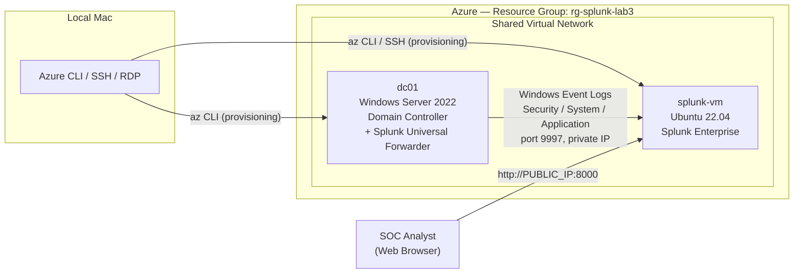
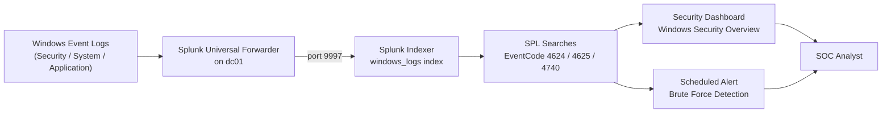
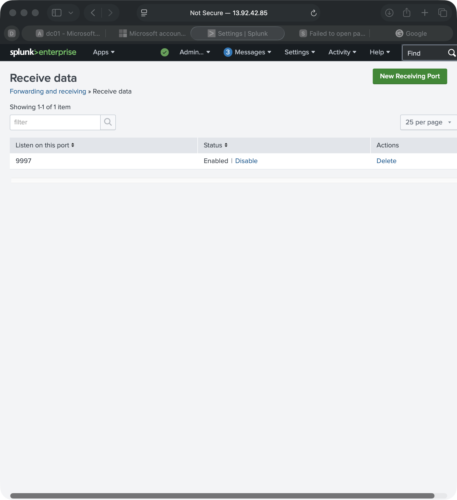
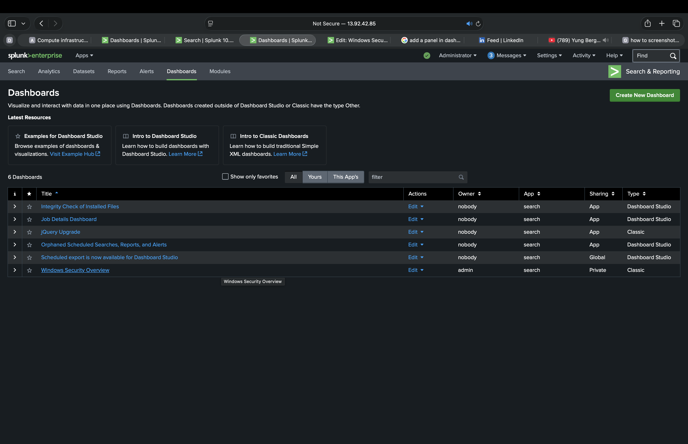
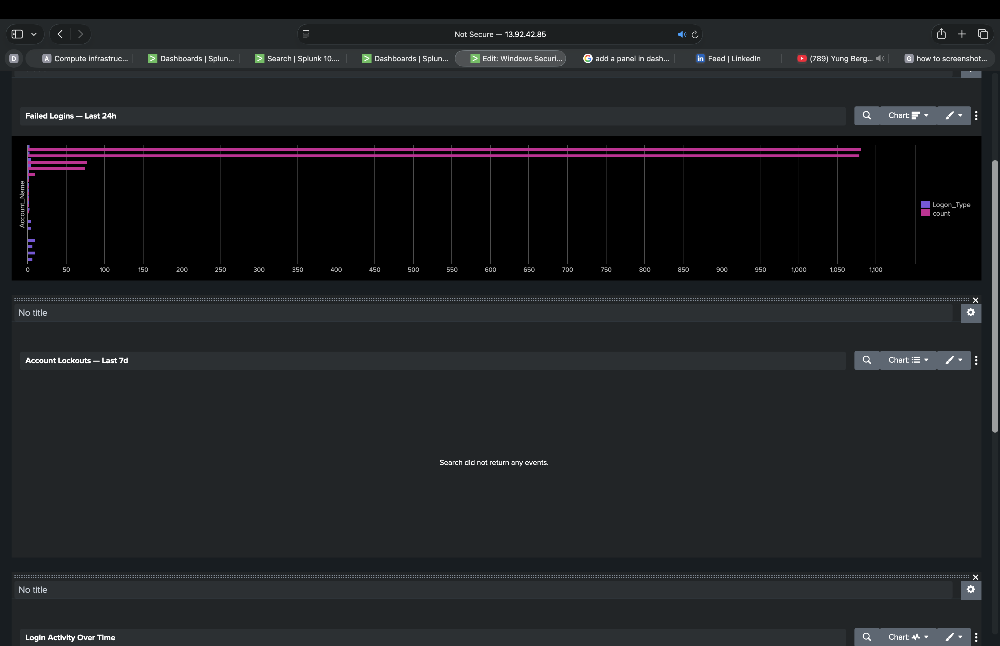
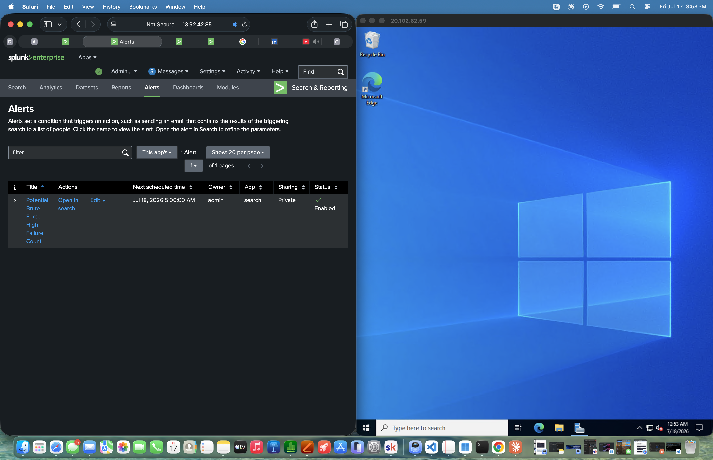

# Lab 3 — Splunk SIEM & Log Analysis

   

> A hands-on SIEM deployment lab demonstrating log collection, security monitoring, and threat detection using Splunk Enterprise on Azure infrastructure.

Cloud & SOC Analyst Portfolio Project

## Overview

Every Windows computer constantly writes a record of what's happening on it — who logged in, when, whether the password was right, what programs ran, what errors occurred. These records are called **Windows Event Logs**, and by default they just sit on that one machine, in local files nobody is watching. In a real company with hundreds or thousands of computers, a security team can't realistically log into each machine individually to check for problems — so instead, those logs get shipped off to one central system that collects logs from everywhere and lets an analyst search across all of them at once. That central system is called a **SIEM** (Security Information and Event Management platform), and it's one of the core tools a SOC (Security Operations Center) analyst uses every single day.

In this lab, I built exactly that setup, from scratch, in the cloud: I deployed **Splunk Enterprise** (one of the most widely used SIEM platforms in the industry) on an Azure virtual machine, then configured a separate Windows Server virtual machine — set up as a domain controller, the kind of machine that manages logins for a company's network — to continuously **forward** its Security, System, and Application event logs over to Splunk. Once the logs were flowing in, I used Splunk's query language (**SPL**, or Search Processing Language) to search through them for suspicious patterns — like repeated failed login attempts, which can indicate someone trying to guess a password. I then turned those searches into a **live dashboard** (a single screen that visually summarizes what's happening, so an analyst doesn't have to re-run searches manually) and a **scheduled alert** (a search that runs automatically every 15 minutes and notifies a human the moment it finds something that looks like a brute-force attack in progress).

This project demonstrates hands-on experience relevant to **SOC Analyst**, **Security Engineer**, and **Incident Responder** roles: standing up a log aggregation platform from scratch, configuring log sources, writing detection searches, and operationalizing them into an alert a real security team would act on.

---

## Architecture

Both VMs run inside a single Azure resource group on a shared virtual network, so log traffic between them stays on Azure's private backbone rather than traversing the public internet.



### Detection pipeline



---

## Data Flow Summary

The two diagrams above show the shape of the system; here's what actually happens, step by step, from a login attempt to an analyst seeing it:

1. **Something happens on `dc01`** — someone logs in successfully, mistypes a password, gets locked out after too many failed attempts, or a Windows service starts or stops. Windows records this instantly in one of three built-in logs: Security, System, or Application.
2. **The Splunk Universal Forwarder** — a lightweight background service installed on `dc01` — is configured (via `inputs.conf`) to continuously watch all three of those logs for new entries.
3. **The forwarder ships each new entry to `splunk-vm`** over TCP port 9997, the standard Splunk forwarder-to-indexer port, using `splunk-vm`'s *private* IP address. Because both VMs sit on the same Azure virtual network, this traffic never leaves Azure's internal network or touches the public internet.
4. **Splunk Enterprise on `splunk-vm` receives and indexes the data**, storing it in the dedicated `windows_logs` index — Splunk's term for an isolated, searchable bucket of stored events.
5. **Saved searches run against that index** in three different ways: on-demand ad hoc searches (manual threat hunting), a dashboard that continuously refreshes four panels so an analyst always has an up-to-date view, and a scheduled search that runs automatically every 15 minutes.
6. **If the scheduled search's results cross a defined threshold** — here, more than 10 failed logins for one account in the search window — Splunk fires the brute-force alert. That's the handoff point where, in a real SOC, an analyst would pick up the alert and start an investigation.

---

## What Was Built

| Component | Details |
| :---- | :---- |
| **SIEM platform** | Splunk Enterprise 10.2.2, deployed on an Azure Ubuntu 22.04 VM (`splunk-vm`) |
| **Log source** | Windows Server 2022 domain controller (`dc01`) running Splunk Universal Forwarder |
| **Data collected** | Windows Security, System, and Application Event Logs, forwarded over port 9997 |
| **Index** | Dedicated `windows_logs` index, isolated from other data sources |
| **Detections** | Failed logons (4625), successful logons (4624), account lockouts (4740), after-hours logon activity, top-10 failed-login threat hunt |
| **Dashboard** | "Windows Security Overview" — 4 panels: failed logins (bar chart), account lockouts (event list), login activity over time (line chart), after-hours source hosts (column chart) |
| **Alert** | Scheduled search (every 15 min) flags any account with 10+ failed logins — a standard brute-force detection threshold |
| **Infrastructure as commands** | Entire environment provisioned via Azure CLI — resource group, both VMs, and NSG port rules — documented step-by-step in [`SOP_Lab3_Splunk_SIEM.md`](./SOP_Lab3_Splunk_SIEM.md) |

---

## Key SPL Queries

SPL (Search Processing Language) is Splunk's query language — every search here follows the same pattern: find events, then pipe (`|`) them through commands that filter, group, or reshape the results. The runnable `.spl` file for each query below is saved in [`scripts/`](./scripts/), so they can be copied straight into Splunk's search bar rather than retyped from this README.

**Confirm data is flowing** — [`scripts/01_confirm_data_flowing.spl`](./scripts/01_confirm_data_flowing.spl)
```spl
index=windows_logs | head 100
```
A basic pulse check — if this returns events, the forwarder is delivering data end to end.

**Failed login attempts (EventCode 4625)** — [`scripts/02_failed_logins_4625.spl`](./scripts/02_failed_logins_4625.spl)
```spl
index=windows_logs sourcetype=WinEventLog:Security EventCode=4625
| stats count by Account_Name, Workstation_Name
| sort -count
```
Groups failed logons by account and source machine. A single account with several failures in a short window suggests brute force; many accounts with 1–2 failures each suggests a password spray attack.

**Successful logins (EventCode 4624)** — [`scripts/03_successful_logins_4624.spl`](./scripts/03_successful_logins_4624.spl)
```spl
index=windows_logs sourcetype=WinEventLog:Security EventCode=4624
| stats count by Account_Name, Logon_Type
```
Groups successful logons by how the user logged in (`Logon_Type`) — interactive, network, service, or remote/RDP — so unexpected remote logons stand out.

**Account lockouts (EventCode 4740)** — [`scripts/04_account_lockouts_4740.spl`](./scripts/04_account_lockouts_4740.spl)
```spl
index=windows_logs sourcetype=WinEventLog:Security EventCode=4740
| table _time, Account_Name, Caller_Computer_Name
| sort -_time
```
Lists lockout events newest-first. Repeated lockouts on one account points to brute force; lockouts spread across many accounts points to password spraying.

**Top 10 failed-login usernames — threat hunting** — [`scripts/05_top10_failed_logins_threat_hunt.spl`](./scripts/05_top10_failed_logins_threat_hunt.spl)
```spl
index=windows_logs sourcetype=WinEventLog:Security EventCode=4625 earliest=-24h
| stats count as failures by Account_Name
| sort -failures
| head 10
```
Surfaces the worst-offending accounts in the last 24 hours. Failed logins against usernames that don't actually exist in Active Directory is a sign of account enumeration — an attacker guessing valid usernames.

**After-hours logon activity** — [`scripts/06_after_hours_logons.spl`](./scripts/06_after_hours_logons.spl)
```spl
index=windows_logs sourcetype=WinEventLog:Security EventCode=4624
| eval hour=strftime(_time, "%H")
| where hour < 7 OR hour > 19
| table _time, Account_Name, Workstation_Name, Logon_Type
| sort -_time
```
Extracts the hour from each successful logon and filters to before 7 AM or after 7 PM. After-hours service-account activity is normal; after-hours interactive or RDP logons from regular users warrant a closer look.

**Brute-force alert search** (scheduled every 15 minutes) — [`scripts/07_brute_force_alert_search.spl`](./scripts/07_brute_force_alert_search.spl)
```spl
index=windows_logs sourcetype=WinEventLog:Security EventCode=4625
| stats count as failures by Account_Name
| where failures > 10
```
The detection behind the "Potential Brute Force — High Failure Count" alert — flags any account with more than 10 failed logins in the search window and notifies the moment it fires, rather than waiting for a human to notice on a dashboard.

---

## Infrastructure Setup

Every resource below was created with an `az` CLI command rather than clicked together in the Azure Portal — repeatable, scriptable, and fully documented in the SOP.

| Resource | Type | Key Settings |
| :---- | :---- | :---- |
| `rg-splunk-lab3` | Azure Resource Group | Region: East US — holds every resource in this lab, so the whole environment can be torn down with one `az group delete` |
| `splunk-vm` | Azure VM | Ubuntu 22.04 LTS, `Standard_D2s_v3` (2 vCPU / 8GB RAM), password authentication, static public IP |
| `dc01` | Azure VM | Windows Server 2022 Datacenter, `Standard_D2s_v3` (2 vCPU / 8GB RAM), promoted to a domain controller (AD DS + DNS roles) |
| Virtual Network | Shared VNet | Auto-created by Azure CLI inside `rg-splunk-lab3`; both VMs were deliberately placed in this one resource group so they'd land on the same network — see "A Real Engineering Decision" below |
| Universal Forwarder | Splunk agent on `dc01` | Points at `splunk-vm`'s private IP on ports 8089 (deployment server) and 9997 (receiving indexer) |

## NSG Rules

Azure auto-attaches a Network Security Group (NSG) to each VM's network interface — it's the firewall controlling exactly which ports can reach the VM from outside. Here's what's open and why:

| Port | Purpose | Why it's open |
| :---- | :---- | :---- |
| 22 | SSH | Lets me remote into `splunk-vm` from my Mac to run Linux and Splunk administration commands |
| 8000 | Splunk Web UI | Lets a browser reach Splunk's web interface for search, dashboards, and alert management |
| 9997 | Forwarder receiving port | Lets the Universal Forwarder on `dc01` deliver collected Windows Event Logs to Splunk's indexer over the private network |
| 3389 (`dc01` only) | RDP | Auto-opened by Azure for Windows VMs; used to remote-desktop into `dc01` for AD DS setup and forwarder configuration |

**Security note:** for simplicity, this home lab leaves these ports open to any source IP. In a production environment, port 9997 in particular would be restricted to the VNet's own IP range only — there's no legitimate reason for the public internet to reach a log-receiving port directly.

---

## A Real Engineering Decision Along the Way

This lab didn't go 100% according to the original plan, and the fix is worth documenting because it's the kind of judgment call a real SOC/cloud engineer has to make.

The original design assumed the Splunk VM would forward logs from a domain controller built in a separate lab (Lab 1), in its own Azure resource group. Once `splunk-vm` was deployed, its virtual network turned out to be scoped only to its own resource group — Azure creates a fresh VNet per resource group by default when one isn't explicitly specified. That meant the two VMs had no private network path between them, and the Universal Forwarder would never have been able to reach Splunk's receiving port.

**The fix:** rebuild the domain controller as a new VM (`dc01`) inside the *same* resource group as `splunk-vm`. Azure CLI reuses an existing VNet in a resource group instead of creating a second one, so this put both machines on one shared network with zero extra peering configuration. The trade-off — a fresh domain controller needed re-promotion (AD DS role install, new forest/domain) rather than reusing existing configuration — was worth it for a simpler, more reliable network topology. Full reasoning and the exact commands are documented in the SOP's "Why the Domain Controller Was Rebuilt as `dc01`" section.

---

## Screenshots

| Splunk configured to receive forwarded data on port 9997 |
| :---: |
|  |

| Windows Security Overview dashboard listed in Splunk |
| :---: |
|  |

| Failed Logins panel — live bar chart of failed logon attempts by account |
| :---: |
|  |

| Brute-force alert enabled and scheduled, alongside the dc01 domain controller running in Azure |
| :---: |
|  |

---

## Key Takeaways

- **Azure's default networking isn't obvious until it breaks something.** Azure auto-creates a new virtual network per resource group unless told otherwise — a sensible default that quietly caused the `dc01`/VNet mismatch in this lab. Understanding *why* that default exists was necessary to fix the actual cause instead of papering over the symptom.
- **Cloud capacity isn't guaranteed on demand.** Hitting a `SkuNotAvailable` error trying to deploy a specific VM size in a busy region was a reminder that real infrastructure planning needs a fallback size, not just a single happy-path spec.
- **The same command can behave differently depending on the shell it's typed into.** PowerShell and bash handle line continuation, quoting, and pasted text differently — several early setup snags in this lab traced back to that, not to the underlying command being wrong.
- **A SIEM is only as good as the pipeline feeding it.** Most of the actual troubleshooting time in this lab went into the forwarder-to-indexer network path — VNets, NSGs, private IPs, port 9997 — rather than into Splunk's search or dashboarding features themselves, which mirrors where security engineering time tends to go in the real world.
- **Documenting the "why" behind a mid-project pivot is itself a skill.** Real infrastructure work rarely goes exactly to plan; being able to explain a deviation clearly — what broke, why, and what the trade-offs of the fix were — turned out to be one of the more valuable parts of this write-up.

---

## Skills Demonstrated

Azure infrastructure provisioning (CLI) · Linux server administration · Windows Server / Active Directory · Splunk Enterprise deployment & administration · SPL (Search Processing Language) · Security log analysis · SOC detection engineering · Network troubleshooting (VNet/NSG) · Git/GitHub version control

**Aligned certifications:** CompTIA Security+ · CompTIA CySA+ · Splunk Core Certified User
